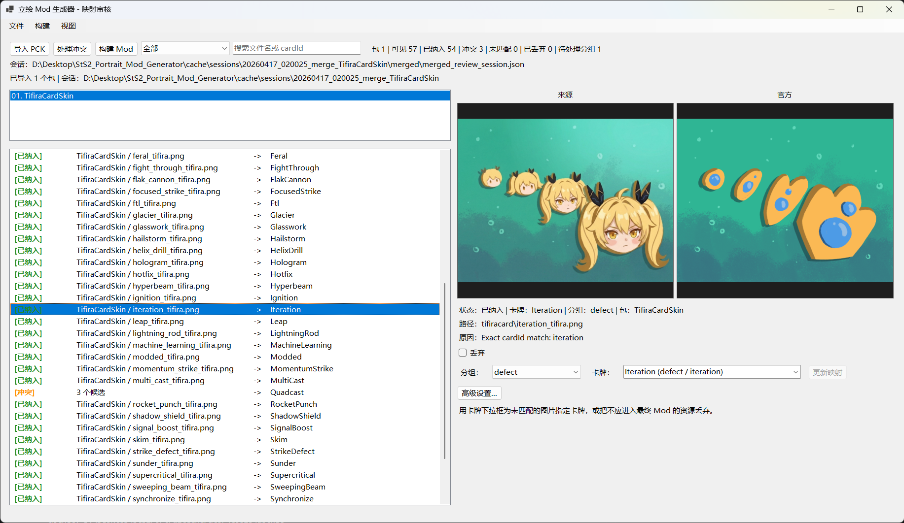

# StS2 Portrait Mod Generator

一套用于把多个 `.pck` 资源包整合成一个 Slay the Spire 2 卡图替换 Mod 的工具链。

工具会依次完成：导入多个 `.pck`、按官方卡牌索引做匹配、在图形界面里解决跨包冲突，最后构建出一个整合后的 Mod 产物。

## 当前能力

- 在同一会话中导入一个或多个 `.pck` 文件（按钮点击或拖拽）。
- 每个包独立完成 GDRE recover、资源扫描，以及与内置官方卡牌索引的映射分析。
- 会话级合并：多个包中匹配到同一 `cardId` 的候选会自动归入冲突组。
- 主映射界面用于查看候选、手动改派 `cardId`、或丢弃噪声资源。
- 冲突界面用于在多个候选之间为每一个争议 `cardId` 选出最终来源。
- 构建界面填写 Mod 元信息后，自动完成模板实例化、复制图片、写入 `card_replacements.json`，并调用 `dotnet build` 输出最终 Mod 产物。

## 截图

主映射界面（Mapping Review），用于审核每个包的候选、手动改派或丢弃：

冲突界面（Conflict Review），用于在多个包都提供同一 `cardId` 时挑选最终来源：

构建界面（Build Mod），用于填写 Mod 元信息并触发最终构建：

## 典型流程

1. 启动 [PortraitModGenerator.Gui](tools/PortraitModGenerator.Gui/)。
2. 点击 **Import PCK**（或把 `.pck` 拖到窗口中）将包加入当前会话，每个包都会独立完成 recover、scan、analyze。
3. 在主映射界面里逐项确认候选：保留自动匹配、为未匹配资源手动指定 `cardId`、把无关资源标记为 discarded。
4. 点击 **Open Conflicts**，处理多个包对同一 `cardId` 都给出候选的情况；每组冲突有一个默认选中项，可手动改写。
5. 点击 **Build Mod**，填写 Mod 元信息（id、name、author、description）和产物输出目录，再点 **Build Mod** 生成最终的 `.dll` / `.json` / `.pck`。

## 仓库结构

- [templates/PortraitReplacementTemplate/](templates/PortraitReplacementTemplate/) — 每次构建都会被实例化的模板 Mod 工程。
- [tools/PortraitModGenerator.Core/](tools/PortraitModGenerator.Core/) — 核心服务：PCK 导入、资源扫描、映射分析、合并、冲突解析、materialize、构建。
- [tools/PortraitModGenerator.Cli/](tools/PortraitModGenerator.Cli/) — 用于脚本化各阶段的 CLI 入口。
- [tools/PortraitModGenerator.Gui/](tools/PortraitModGenerator.Gui/) — 串起整套流水线的 WinForms 界面。
- [data/official_card_index.json](data/official_card_index.json) — 内置的官方 `cardId` 基线。
- [gdre/](gdre/) — 随仓库分发的 GDRETools，用于 `.pck` recover。
- [packages/](packages/) — 模板工程构建所需的本地 NuGet feed。
- [docs/](docs/) — 设计说明与截图。

GUI 会把工作内容写到 `cache/sessions/<时间戳>_<标签>/` 下，每个导入的包占一个子目录，外加一份合并后的会话 JSON。最终 Mod 产物默认输出到 `artifacts/<ModId>/`。

## CLI

CLI 暴露了流水线的各个阶段，便于脚本化或调试：

- `generate-template` — 用 `--mod-id` 等元信息把模板实例化到目标目录。
- `import-pck` — 通过 GDRETools 解包单个 `.pck`。
- `scan-assets` — 扫描 recover 目录里的图片资源，输出 `asset_scan_result.json`。
- `analyze-mappings` — 把扫描结果与官方卡牌索引比对，输出 `mapping_analysis_result.json`。
- `materialize-mappings` — 把选中的图片复制到生成的 Mod 工程，并写入 `card_replacements.json`。

任意命令加 `--help` 可查看完整参数说明。

## 构建说明

- 所有项目目标框架为 `net10.0`。
- GUI 是 Windows 专属的 WinForms 程序。
- 模板 Mod 工程依赖用户本地安装的 Slay the Spire 2，用于发现 `sts2.dll` 和 Godot 数据，详见 [Sts2PathDiscovery.props](templates/PortraitReplacementTemplate/src/Sts2PathDiscovery.props)。
- 仓库根的 `nuget.config` 把 `globalPackagesFolder` 指向 `packages/`，模板工程默认走仓库内置 feed。

发布目录里会预创建 `cache/`、`artifacts/`、`logs/` 三个工作目录；`Slay the Spire 2` 游戏本体及其安装目录中的 dll、数据文件不会被打包，仍由用户本地安装提供。

## 文档

- [docs/OFFICIAL_CARD_INDEX.md](docs/OFFICIAL_CARD_INDEX.md) — 内置官方卡牌索引数据集的格式与用途说明。
